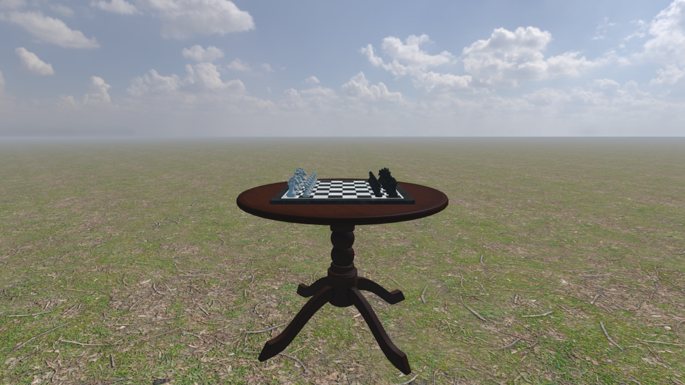
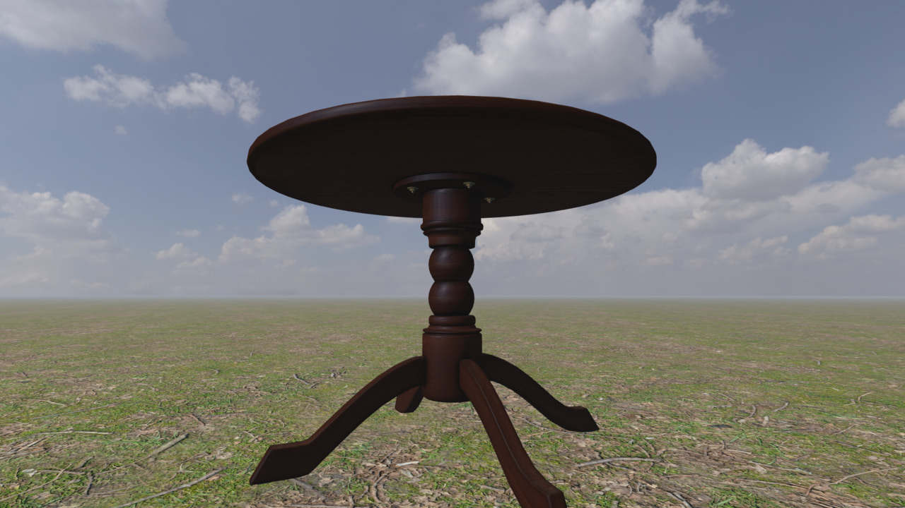
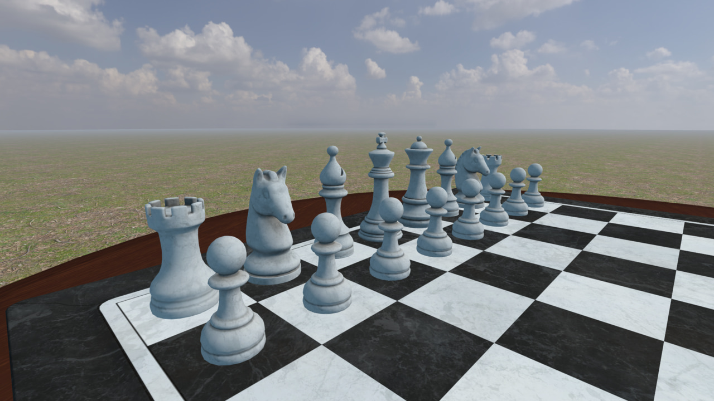
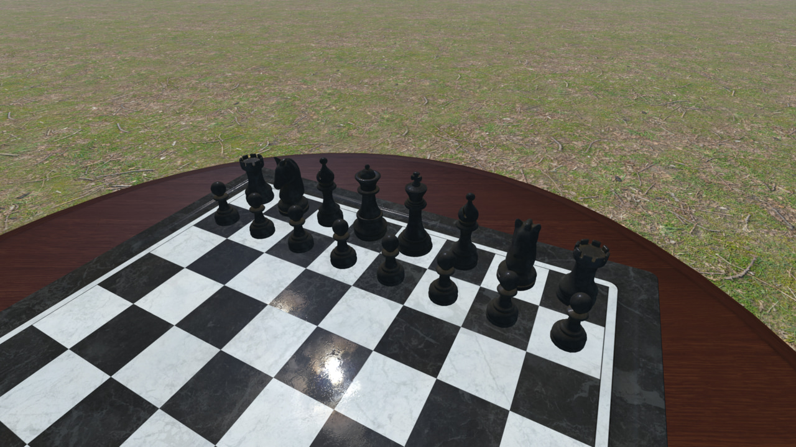

# FCG - Trabalho Final

2025/1 - Turma A

Dupla: João Pastorello e Isadora Schwaab

## Contribuições

## Uso de IAs generativas

O **ChatGPT** foi utilizado principalmente para esclarescer conceitos de C++, como o uso de ponteiros inteligentes, estruturas de dados e processamento assíncrono.
Além disso, gerou um esboço do sistema de estados (classes `GameState` e `GameStateManager`) que foi adaptado e incrementado para a utilização no jogo.
No geral, a ferramenta foi útil, mas se mostrou incapaz de auxiliar com decisões complexas.
Conseguiu substituir muitas buscas rápidas na documentação e internet, mas não tarefas de raciocínio lógico avançado.

## Conceitos de Computação Gráfica aplicados no desenvolvimento

- [x] Malhas poligonais complexas
- [x] Transformações geométricas controladas pelo usuário
- [x] Câmera livre e câmera look-at
- [x] Instâncias de objetos
- [ ] Três tipos de testes de intersecção
- [x] Modelos de Iluminação Difusa e Blinn-Phong
- [x] Modelos de Interpolação de Phong e Gouraud
- [x] Mapeamento de texturas em todos os objetos
- [x] Movimentação com curva Bézier cúbica
- [x] Animações baseadas no tempo ($\Delta t$)

Extras:
- [x] Mapeamento de normais
- [x] SkyBox com Reflection Mapping
- [x] Seleção de casas do tabuleiro com o mouse




*Malhas poligonais complexas*


*Modelo de Iluminação Difusa de Lambert com Interpolação de Gouraud*


*Modelo de Iluminação de Blinn-Phong com Interpolação de Phong*


## Manual de usuário

## Compilação

Este repositório faz uso de submódulos git para incluir bibliotecas externas.
Para clonar o repositório juntamente com os submódulos utilizados, use o seguinte comando:

```shell
git clone --recurse-submodules https://github.com/jspast/fcg.git
```

Caso o repositório já esteja clonado sem os submódulos, use o comando:

```shell
git submodule update --init --recursive
```

### Windows

#### VSCode (Visual Studio Code)
1) Instale o [VSCode](https://code.visualstudio.com/).

2) Instale o compilador GCC no Windows seguindo as [instruções do VSCode](https://code.visualstudio.com/docs/cpp/config-mingw#_installing-the-mingww64-toolchain).

3) Instale o [CMake](https://cmake.org/download/).

4) Instale as extensões `ms-vscode.cpptools` e `ms-vscode.cmake-tools` no VSCode.
Se você abrir o diretório deste projeto no VSCode, automaticamente será sugerida a instalação destas extensões.

5) Abra as configurações da extensão cmake-tools (Ctrl-Shift-P e busque por `CMake: Open CMake Tools Extension Settings`), e adicione o caminho de instalação do GCC na opção de configuração `additionalCompilerSearchDirs`.

6) Clique no botão de "Play" na barra inferior do VSCode para compilar e executar o projeto.
Na primeira compilação, a extensão do CMake para o VSCode irá perguntar qual compilador você quer utilizar.
Selecione da lista o compilador GCC que você instalou com o MSYS/MinGW.

Se necessário, mais [instruções de uso do CMake no VSCode](https://github.com/microsoft/vscode-cmake-tools/blob/main/docs/README.md) estão disponíveis.

Caso você tenha problemas de compilação no Windows com GCC, cuide para extrair o código em um caminho que não contenha espaços no nome de algum diretório.

Caso você tenha problemas de execução, tente atualizar o driver da sua placa de vídeo.

### Linux

#### Instalando bibliotecas necessárias

##### Ubuntu

```shell
apt-get install build-essential make libx11-dev libxrandr-dev libxinerama-dev libxcursor-dev libxcb1-dev libxext-dev libxrender-dev libxfixes-dev libxau-dev libxdmcp-dev
```

##### Linux Mint

```shell
apt-get install build-essential make libx11-dev libxrandr-dev libxinerama-dev libxcursor-dev libxcb1-dev libxext-dev libxrender-dev libxfixes-dev libxau-dev libxdmcp-dev libmesa-dev libxxf86vm-dev
```

##### Fedora Linux

```shell
dnf install make automake gcc gcc-c++ kernel-devel libXxf86vm-devel mesa-libGL-devel libxcb-devel libX11-devel libXrandr-devel libXinerama-devel libXcursor-devel libXext-devel libXrender-devel libXfixes-devel libXau-devel libXdmcp-devel
```

#### VSCode (Visual Studio Code)
1) Instale o [VSCode](https://code.visualstudio.com/).

2) Instale as extensões `ms-vscode.cpptools` e `ms-vscode.cmake-tools` no VSCode.
Se você abrir o diretório deste projeto no VSCode, automaticamente será sugerida a instalação destas extensões.

3) Clique no botão de "Play" na barra inferior do VSCode para compilar
e executar o projeto.
Na primeira compilação, a extensão do CMake para o VSCode irá perguntar qual compilador você quer utilizar.
Selecione da lista o compilador que você deseja utilizar.

Se necessário, mais [instruções de uso do CMake no VSCode](https://github.com/microsoft/vscode-cmake-tools/blob/main/docs/README.md) estão disponíveis.

### macOS (não testado)
Para compilar e executar esse projeto no macOS, primeiro você precisa instalar o HOMEBREW, um gerenciador de pacotes para facilitar a instação de bibliotecas.
O HOMEBREW pode ser instalado com o seguinte comando no terminal:

```shell
/usr/bin/ruby -e "$(curl -fsSL https://raw.githubusercontent.com/Homebrew/install/master/install)"
```

Após a instalação do HOMEBREW, a biblioteca GLFW deve ser instalada.
Isso pode ser feito pelo terminal com o comando:

```shell
brew install glfw
```

#### Makefile
Abra um terminal no diretório do projeto e execute o comando `make -f Makefile.macOS` para compilar.
Para executar o código compilado, execute o comando `make -f Makefile.macOS run`.
